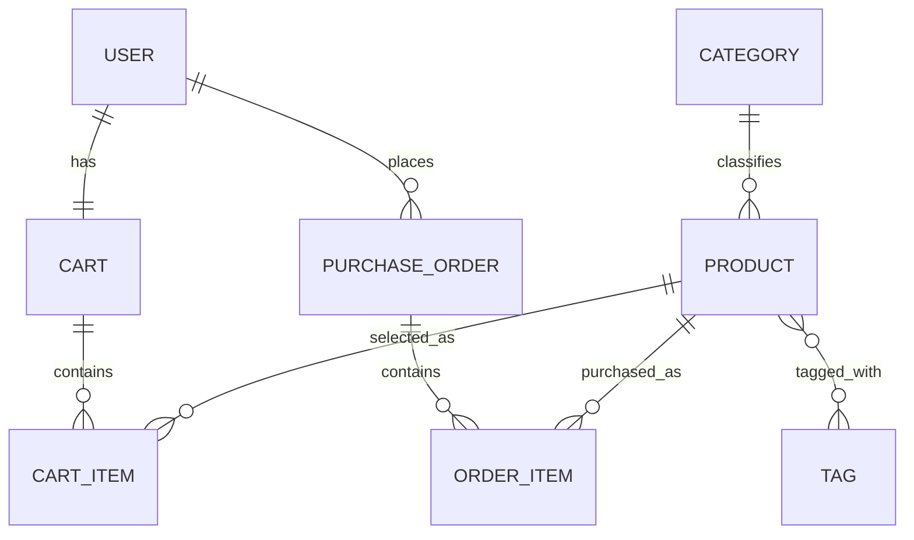

# JPA Shopping Cart Workshop — Answer Guide

This document provides suggested answers to the discussion questions in the JPA Shopping Cart workshop.

The answers are intended to help students understand the reasoning behind the JPA mappings, rather than simply memorising annotations.

---

# Setup Check

`Spring Data JPA` and the H2 driver are the dependencies needed for the JPA persistence exercise. `Spring Web` is included only so students can open the browser-based H2 Console at `/h2-console`; JPA itself does not require Spring Web.

---

# Reference ERD Used by the Answers

The answers below follow the same ERD and Java property names used by the workshop script.



Foreign-key placement:

```text
CART.user_id
CART_ITEM.cart_id
CART_ITEM.product_id
PRODUCT.category_id
PURCHASE_ORDER.user_id
ORDER_ITEM.purchase_order_id
ORDER_ITEM.product_id
PRODUCT_TAG.product_id
PRODUCT_TAG.tag_id
```

## One-to-One Mapping Check

For the `User`–`Cart` relationship, the ERD defines one cart per user and the foreign key is stored in `CART.user_id`.

The owning side should therefore be:

```java
@OneToOne
@JoinColumn(name = "user_id", nullable = false, unique = true)
private User user;
```

and the inverse side should be:

```java
@OneToOne(mappedBy = "user")
private Cart cart;
```

`unique = true` enforces the one-to-one rule at the database level.

---

# Question 1 — Why do we use `CartItem` instead of creating a direct many-to-many relationship between `Cart` and `Product`?

A direct many-to-many relationship would only describe that a cart contains products.

However, the shopping cart also needs to store additional information about each selected product, such as:

```text
quantity
addedAt
```

For example:

```text
Cart
 |
 ├── 1 × Laptop
 └── 2 × Headphones
```

The quantity does not belong to `Cart` alone and it does not belong to `Product` alone.

It belongs to the relationship between the cart and the product.

Therefore, we introduce `CartItem` as a separate entity:

```text
Cart 1 ─── * CartItem * ─── 1 Product
```

`CartItem` can then contain:

```java
private Integer quantity;
private LocalDateTime addedAt;
```

### Key idea

> Use an intermediate entity when the relationship itself needs to store additional business data.

---

# Question 2 — Why do we use `OrderItem` instead of directly connecting `PurchaseOrder` and `Product`?

A purchase order contains products, but we also need to record information about each product at the time of purchase.

For example:

```text
quantity
unitPrice
```

A direct many-to-many relationship:

```text
PurchaseOrder * ─── * Product
```

would not naturally store these additional values.

Instead, we use:

```text
PurchaseOrder 1 ─── * OrderItem * ─── 1 Product
```

`OrderItem` represents one purchased product line inside the order.

Example:

```text
Order #1001
 |
 ├── 1 × Laptop       @ $1,350
 └── 2 × Headphones   @ $237.50
```

### Key idea

> `OrderItem` stores information about the purchase transaction, not just the product relationship.

---

# Question 3 — Why is `unitPrice` stored inside `OrderItem`?

The price in `Product` represents the **current product price**.

However, product prices may change over time.

Example:

```text
Price when customer purchased laptop: $1,350

Current laptop price:                 $1,500
```

If the order only referenced:

```java
product.getPrice()
```

then an old order could incorrectly show the new price.

Therefore, the application stores the purchase price inside:

```java
OrderItem.unitPrice
```

This creates a historical snapshot.

Example:

```java
orderItem.setUnitPrice(1350.00);
```

Even if:

```java
product.setPrice(1500.00);
```

later, the old order still records `$1,350`.

### Key idea

> Historical transaction data should not depend on values that may change later.

---

# Question 4 — What does `mappedBy` mean?

`mappedBy` tells JPA that:

> This side of the relationship does not own the database foreign key or join relationship.

It points to the Java field on the owning side.

Example:

```java
public class CartItem {

    @ManyToOne
    @JoinColumn(name = "cart_id")
    private Cart cart;
}
```

`CartItem` owns the relationship because its table contains:

```text
cart_id
```

The other side uses:

```java
public class Cart {

    @OneToMany(mappedBy = "cart")
    private List<CartItem> items;
}
```

Here:

```java
mappedBy = "cart"
```

refers to:

```java
private Cart cart;
```

inside `CartItem`.

It does **not** refer to the database column:

```text
cart_id
```

### Key idea

> `mappedBy` refers to the Java property that owns the relationship.

---

# Question 5 — Why is `CartItem` the owning side of the `Cart`–`CartItem` relationship?

Look at where the foreign key is stored.

The database structure is approximately:

```text
CART
----------------
id


CART_ITEM
----------------
id
cart_id
product_id
quantity
```

The foreign key:

```text
cart_id
```

is stored in `CART_ITEM`.

Therefore `CartItem` controls which cart the row belongs to.

The owning side is:

```java
@ManyToOne
@JoinColumn(name = "cart_id")
private Cart cart;
```

The inverse side is:

```java
@OneToMany(mappedBy = "cart")
private List<CartItem> items;
```

### Key idea

> For a normal one-to-many / many-to-one relationship, the entity containing the foreign key is usually the owning side.

---

# Question 6 — What is the difference between `@JoinColumn` and `@JoinTable`?

## `@JoinColumn`

`@JoinColumn` is normally used when one table directly stores a foreign key referencing another table.

Example:

```java
@ManyToOne
@JoinColumn(name = "category_id")
private Category category;
```

Database:

```text
PRODUCT
----------------
id
name
category_id
```

Here:

```text
PRODUCT.category_id
```

directly references:

```text
CATEGORY.id
```

---

## `@JoinTable`

`@JoinTable` is used when a separate table is needed to connect two entities.

A common example is many-to-many:

```java
@ManyToMany
@JoinTable(
    name = "product_tag",
    joinColumns = @JoinColumn(name = "product_id"),
    inverseJoinColumns = @JoinColumn(name = "tag_id")
)
private Set<Tag> tags;
```

Database:

```text
PRODUCT
TAG

PRODUCT_TAG
----------------
product_id
tag_id
```

### Key idea

```text
@JoinColumn
    ↓
Foreign key exists directly in one entity table


@JoinTable
    ↓
A separate table connects the two entity tables
```

---

# Question 7 — Why does the Product–Tag relationship require a join table?

The business relationship is:

```text
Product * ─── * Tag
```

A product can have many tags:

```text
Laptop
 ├── Popular
 └── Sale
```

and a tag can be assigned to many products:

```text
Popular
 ├── Laptop
 ├── Headphones
 └── Spring Boot Guide
```

We cannot simply store one `tag_id` inside `Product`, because one product may have multiple tags.

We also cannot simply store one `product_id` inside `Tag`, because one tag may belong to multiple products.

Therefore, we need an intermediate table:

```text
PRODUCT_TAG
----------------
product_id
tag_id
```

Example rows:

```text
product_id | tag_id
-----------|-------
1          | 1
1          | 2
2          | 1
2          | 3
```

### Key idea

> A many-to-many database relationship is normally represented using a join table.

---

# Question 8 — Why should a helper method such as `cart.addItem(cartItem)` update both sides of the Java relationship?

In a bidirectional relationship, both Java objects contain references to each other.

For example:

```java
class Cart {
    private List<CartItem> items;
}
```

and:

```java
class CartItem {
    private Cart cart;
}
```

If we only write:

```java
cart.getItems().add(cartItem);
```

then:

```java
cart.getItems()
```

contains the item, but:

```java
cartItem.getCart()
```

may still be `null`.

The Java object model is now inconsistent.

A helper method solves this:

```java
public void addItem(CartItem item) {
    items.add(item);
    item.setCart(this);
}
```

Now both directions are synchronized:

```text
Cart
  ↓
CartItem

and

CartItem
  ↓
Cart
```

This is especially important because the owning side determines the database relationship.

### Key idea

> In a bidirectional relationship, keep both Java object references synchronized.

This is an **object-model consistency rule**. JPA still determines the database relationship from the owning side. For example, `CartItem.cart` controls `CART_ITEM.cart_id`; adding the item only to `Cart.items` without setting `CartItem.cart` does not correctly establish the owning side.

---

# Question 9 — What does `CascadeType.ALL` do?

Cascade controls whether an operation performed on one entity should automatically be applied to its related entity.

Example:

```java
@OneToMany(
    mappedBy = "cart",
    cascade = CascadeType.ALL
)
private List<CartItem> items;
```

Suppose:

```java
Cart cart = new Cart();

CartItem item1 = new CartItem();
CartItem item2 = new CartItem();

cart.addItem(item1);
cart.addItem(item2);
```

When we save:

```java
cartRepository.save(cart);
```

the cascade allows the corresponding persistence operation to propagate to the related `CartItem` objects. For a new `Cart`, this means the new `CartItem` records can be persisted together with the cart.

Without cascade, we may need to save them separately.

`CascadeType.ALL` includes operations such as:

```text
PERSIST
MERGE
REMOVE
REFRESH
DETACH
```

Conceptually:

```text
Save Cart
   ↓
Save its CartItems


Delete Cart
   ↓
Delete its CartItems
```

### Important

Cascade should not be added to every relationship automatically.

It should be used only when the child entity's lifecycle should follow the parent.

### Key idea

> Cascade means that entity lifecycle operations can propagate from the parent to related entities.

---

# Question 10 — What does `orphanRemoval = true` mean?

Consider:

```java
@OneToMany(
    mappedBy = "cart",
    cascade = CascadeType.ALL,
    orphanRemoval = true
)
private List<CartItem> items;
```

Suppose a cart contains:

```text
Laptop
Headphones
Book
```

Then the user removes the headphones:

```java
cart.removeItem(headphonesItem);
```

With:

```java
orphanRemoval = true
```

the removed `CartItem` is no longer associated with its parent `Cart`.

JPA treats it as an orphan and deletes the corresponding database row.

Conceptually:

```text
Before

Cart
 ├── CartItem A
 ├── CartItem B
 └── CartItem C
```

Remove `CartItem B`:

```text
After

Cart
 ├── CartItem A
 └── CartItem C
```

The database row for `CartItem B` is deleted when the persistence context is flushed/committed.

### Difference from cascade remove

`CascadeType.REMOVE` normally applies when the **parent itself is deleted**.

Example:

```text
Delete Cart
    ↓
Delete CartItems
```

`orphanRemoval = true` applies when a child is **removed from the parent's relationship**.

Example:

```text
Cart still exists

Remove one CartItem
        ↓
Delete that CartItem
```

### Key idea

> `orphanRemoval = true` removes a child from the database when it is no longer owned by the parent.

---

# Additional Review — Owning Side Answers

| Relationship | Owning Side | Inverse Side | Reason |
|---|---|---|---|
| User ↔ Cart | `Cart` | `User` | `CART` contains `user_id` |
| Cart ↔ CartItem | `CartItem` | `Cart` | `CART_ITEM` contains `cart_id` |
| CartItem → Product | `CartItem` | N/A | `CART_ITEM` contains `product_id` |
| Category ↔ Product | `Product` | `Category` | `PRODUCT` contains `category_id` |
| Product ↔ Tag | `Product` | `Tag` | `Product` defines `@JoinTable` |
| User ↔ PurchaseOrder | `PurchaseOrder` | `User` | `PURCHASE_ORDER` contains `user_id` |
| PurchaseOrder ↔ OrderItem | `OrderItem` | `PurchaseOrder` | `ORDER_ITEM` contains `purchase_order_id` |
| OrderItem → Product | `OrderItem` | N/A | `ORDER_ITEM` contains `product_id` |

---

# Reference Script Compatibility

The answer guide is aligned with the workshop dummy-data script.

The script creates:

```text
2 Categories
3 Tags
3 Products
1 User
1 Cart
2 CartItems
1 PurchaseOrder
2 OrderItems
1 assigned `OrderStatus` enum value
```

The following helper methods are expected.

```java
// Cart
public void addItem(CartItem item) {
    items.add(item);
    item.setCart(this);
}

public Integer getTotalItems() {
    return items.stream()
            .mapToInt(CartItem::getQuantity)
            .sum();
}

public Double getTotal() {
    return items.stream()
            .mapToDouble(CartItem::getSubtotal)
            .sum();
}
```

```java
// PurchaseOrder
public void addItem(OrderItem item) {
    items.add(item);
    item.setPurchaseOrder(this);
}
```

```java
// Product
public void addTag(Tag tag) {
    tags.add(tag);
    tag.getProducts().add(this);
}
```

The reference seed script saves `Tag` entities before saving the `Product` entities. This matches the mapping because no cascade persist is defined from `Product` to `Tag`.

```java
// CartItem
public Double getSubtotal() {
    if (product == null || product.getPrice() == null || quantity == null) {
        return 0.0;
    }

    double price = product.getPrice();

    if (product.getDiscountPercent() != null) {
        price = price * (1 - product.getDiscountPercent() / 100.0);
    }

    return price * quantity;
}
```

```java
// OrderItem
public Double getSubtotal() {
    if (unitPrice == null || quantity == null) {
        return 0.0;
    }

    return unitPrice * quantity;
}
```

The reference `PurchaseOrder` mapping is:

```java
@OneToMany(
    mappedBy = "purchaseOrder",
    cascade = CascadeType.ALL,
    orphanRemoval = true
)
private List<OrderItem> items = new ArrayList<>();
```

This is compatible with:

```java
purchaseOrderRepository.save(order);
```

because the related `OrderItem` records are persisted through cascade.

# Summary

The most important principle in this workshop is not to memorise the annotations.

Instead, follow this reasoning process:

```text
1. Understand the business relationship
             ↓
2. Look at the ERD
             ↓
3. Find where the foreign key is stored
             ↓
4. Identify the owning side
             ↓
5. Apply the correct JPA annotations
```

Example:

```text
Business:
Each product belongs to one category

        ↓

ERD:
Category 1 ─── * Product

        ↓

Database:
PRODUCT.category_id

        ↓

Owning side:
Product

        ↓

JPA:
@ManyToOne
@JoinColumn(name = "category_id")
```

Once you understand the database relationship, the JPA mapping becomes much easier to determine.
