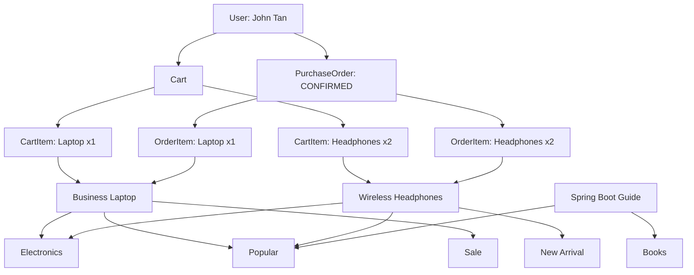

# Workshop: Building a Shopping Cart Data Model with JPA

## 1. Workshop Overview

In this workshop, you will build the **JPA entity model** for a simple online shopping application based on the provided ERD.

The purpose of this workshop is to practise how to translate:

**Business Requirement → ERD → Foreign Key → Owning Side → JPA Mapping**

You will focus on:

- Creating JPA entity classes
- Defining primary keys
- Mapping entity relationships
- Identifying the owning and inverse sides
- Using `@JoinColumn`, `mappedBy`, and `@JoinTable`
- Applying cascade and orphan removal
- Creating dummy data to verify the mappings
- Inspecting the generated database tables in H2

> This workshop focuses on the **JPA data model only**.  
> You are not required to implement controllers, REST APIs, authentication, DTOs, or service-layer business logic.

---

# 2. Business Context

You have joined a development team that is building a simple **online shopping application**.

The business wants customers to be able to:

1. Register an account
2. Browse products
3. Browse products by category
4. Identify products using tags such as `Popular`, `Sale`, and `New Arrival`
5. Add products to a shopping cart
6. Specify the quantity of each product in the cart
7. Place an order
8. Keep a history of purchased products and their purchase prices

The business analyst has already prepared the ERD.

Your task is to translate the ERD into Java classes using **JPA annotations**.

---

# 3. Business Rules

Before writing any Java code, understand the business rules represented by the ERD.

## 3.1 User and Shopping Cart

Each registered user has one shopping cart.

```text
User 1 ───── 1 Cart
```

Example:

```text
John Tan
   |
   └── Shopping Cart
```

A shopping cart belongs to only one user.

---

## 3.2 Shopping Cart and Cart Items

A shopping cart may contain many products.

The application does not connect `Cart` directly to `Product`. Instead, it uses `CartItem`.

```text
Cart
 |
 ├── CartItem → Business Laptop
 ├── CartItem → Wireless Headphones
 └── CartItem → Spring Boot Guide
```

`CartItem` is required because the application also needs to store information such as:

- Quantity
- Date and time the item was added

Example:

```text
John's Cart

1 × Business Laptop
2 × Wireless Headphones
3 × Spring Boot Guide
```

---

## 3.3 Product and Category

Each product belongs to one category.

A category can contain many products.

```text
Category 1 ───── * Product
```

Example:

```text
Electronics
 |
 ├── Business Laptop
 └── Wireless Headphones

Books
 |
 └── Spring Boot Guide
```

---

## 3.4 Product and Tag

A product may have several tags.

The same tag may also be assigned to many products.

```text
Product * ───── * Tag
```

Example:

```text
Business Laptop
 ├── Popular
 └── Sale

Wireless Headphones
 ├── Popular
 └── New Arrival
```

This is a **many-to-many relationship**.

---

## 3.5 User and Purchase Order

A user may place many orders over time.

```text
User 1 ───── * PurchaseOrder
```

Example:

```text
John Tan
 |
 ├── Order #1001
 ├── Order #1002
 └── Order #1003
```

---

## 3.6 Purchase Order and Order Item

An order can contain several purchased products.

```text
PurchaseOrder 1 ───── * OrderItem
```

Example:

```text
Order #1001
 |
 ├── 1 × Business Laptop
 └── 2 × Wireless Headphones
```

Each `OrderItem` references one `Product`.

---

## 3.7 Why Store `unitPrice` in OrderItem?

Product prices can change after an order has been placed.

Example:

```text
Laptop price when purchased:  $1,350
Laptop price one month later: $1,500
```

The customer's historical order must still show the price paid at checkout.

Therefore, `OrderItem` stores:

```java
private Double unitPrice;
```

`unitPrice` represents the **price at the time the order was created**.

---

# 3A. Reference ERD

Use ERD provided by the lecturer. The class names, relationships, owning sides, foreign keys, and property names are aligned with the Java source code used in this workshop.

The `Product`–`Tag` many-to-many relationship uses this join table:

```text
PRODUCT_TAG
----------------
product_id  FK
tag_id      FK
```

If your Markdown viewer does not render Mermaid, use the lecturer-provided ERD image or this relationship summary:

```text
User 1 ───── 1 Cart
User 1 ───── * PurchaseOrder
Cart 1 ───── * CartItem
CartItem * ───── 1 Product
Category 1 ───── * Product
Product * ───── * Tag
PurchaseOrder 1 ───── * OrderItem
OrderItem * ───── 1 Product
```

# 4. Project Setup

## Task 1 — Create the Spring Boot Project

Create a Spring Boot project with the following dependencies:

- Spring Data JPA
- H2 Database
- Spring Web

> `Spring Web` is not required by JPA itself. It is included in this workshop so that the browser-based H2 Console can be accessed at `/h2-console`. The JPA entity mappings themselves depend on Spring Data JPA, not Spring Web.

Your `pom.xml` should include dependencies equivalent to:

```xml
<dependency>
    <groupId>org.springframework.boot</groupId>
    <artifactId>spring-boot-starter-web</artifactId>
</dependency>

<dependency>
    <groupId>org.springframework.boot</groupId>
    <artifactId>spring-boot-starter-data-jpa</artifactId>
</dependency>

<dependency>
    <groupId>com.h2database</groupId>
    <artifactId>h2</artifactId>
    <scope>runtime</scope>
</dependency>
```

---

## Task 2 — Configure H2

Configure `application.properties`:

```properties
spring.datasource.url=jdbc:h2:mem:shoppingdb
spring.datasource.username=sa
spring.datasource.password=

spring.jpa.hibernate.ddl-auto=create-drop
spring.jpa.show-sql=true

spring.h2.console.enabled=true
spring.h2.console.path=/h2-console
```

When the application starts, Hibernate should automatically create the required database tables.

---

# 5. Create the Entity Classes

## Task 3 — Create the Required Classes

Create the following entity classes:

```text
User
Cart
CartItem
Product
Category
Tag
PurchaseOrder
OrderItem
```

Also create the enum:

```text
OrderStatus
```

Each entity must use:

```java
@Entity
```

and contain a generated primary key:

```java
@Id
@GeneratedValue(strategy = GenerationType.IDENTITY)
private Long id;
```

Example:

```java
@Entity
public class Category {

    @Id
    @GeneratedValue(strategy = GenerationType.IDENTITY)
    private Long id;

    private String name;

    private String description;
}
```

---

# 6. Implement the JPA Relationships

## Task 4 — User and Cart

Business rule:

> Each user has one shopping cart, and each cart belongs to one user.

```text
User 1 ───── 1 Cart
```

The foreign key is stored in the `Cart` table.

Before implementing the relationship, answer:

```text
Which entity is the owning side?
Which entity is the inverse side?
```

Use the following mapping on the owning side (`Cart`):

```java
@OneToOne
@JoinColumn(name = "user_id", nullable = false, unique = true)
private User user;
```

Use the inverse mapping on `User`:

```java
@OneToOne(mappedBy = "user")
private Cart cart;
```

`unique = true` is important because the ERD defines a one-to-one relationship: one user must not be referenced by multiple carts.

Expected database concept:

```text
USERS
------
id


CART
------
id
user_id  FK
```

---

## Task 5 — Cart and CartItem

Business rule:

> A cart can contain many cart items, and each cart item belongs to one cart.

```text
Cart 1 ───── * CartItem
```

The foreign key is stored in:

```text
CART_ITEM.cart_id
```

Use the appropriate:

```java
@OneToMany
@ManyToOne
@JoinColumn
mappedBy
```

annotations.

The `Cart` → `CartItem` relationship must use:

```java
cascade = CascadeType.ALL
orphanRemoval = true
```

Also create a helper method:

```java
public void addItem(CartItem item) {
    items.add(item);
    item.setCart(this);
}
```

This method should keep both sides of the Java relationship synchronized.

---

## Task 6 — CartItem and Product

Business rule:

> Each cart item references one product, but the same product may appear in many carts.

```text
CartItem * ───── 1 Product
```

Determine:

```text
Where should product_id be stored?
Which entity owns the relationship?
```

Implement the appropriate JPA mapping.

---

## Task 7 — Category and Product

Business rule:

> A category can contain many products, and each product belongs to one category.

```text
Category 1 ───── * Product
```

The `Product` table contains:

```text
category_id
```

Implement the owning and inverse sides using the correct annotations.

---

## Task 8 — Product and Tag

Business rule:

> A product may have several tags, and the same tag may be assigned to several products.

```text
Product * ───── * Tag
```

Use a join table:

```text
PRODUCT_TAG
----------------
product_id
tag_id
```

`Product` is the owning side.

Inside `Product`, use:

```java
@ManyToMany
@JoinTable(...)
```

Inside `Tag`, use:

```java
@ManyToMany(mappedBy = "tags")
```

Think about:

> Why does the inverse side not define another `@JoinTable`?

---

## Task 9 — User and PurchaseOrder

Business rule:

> A user may place multiple purchase orders over time.

```text
User 1 ───── * PurchaseOrder
```

Determine:

```text
Which table contains user_id?
Which entity owns the relationship?
Which entity should use mappedBy?
```

Implement the relationship.

---

## Task 10 — PurchaseOrder and OrderItem

Business rule:

> One purchase order can contain many order items.

```text
PurchaseOrder 1 ───── * OrderItem
```

Implement the relationship using:

```java
@OneToMany
@ManyToOne
```

For this workshop, use:

```java
cascade = CascadeType.ALL
orphanRemoval = true
```

on the `PurchaseOrder` → `OrderItem` relationship.

Also create:

```java
public void addItem(OrderItem item) {
    items.add(item);
    item.setPurchaseOrder(this);
}
```

---

## Task 11 — OrderItem and Product

Business rule:

> Each order item references one purchased product.

```text
OrderItem * ───── 1 Product
```

`OrderItem` must contain at least:

```java
private Integer quantity;
private Double unitPrice;
```

`unitPrice` must represent the price at checkout time.

Example:

```text
Current Product price:  $1,500
Price during checkout:  $1,350

OrderItem.unitPrice:    $1,350
```

---

# 7. Create the Order Status Enum

## Task 12 — Create OrderStatus

Create:

```java
public enum OrderStatus {

    PENDING,
    CONFIRMED,
    SHIPPED,
    DELIVERED,
    CANCELLED
}
```

Inside `PurchaseOrder`, map it using:

```java
@Enumerated(EnumType.STRING)
private OrderStatus status;
```

The database should store:

```text
CONFIRMED
```

instead of:

```text
1
```

---

# 8. Identify the Owning Side

## Task 13 — Complete the Relationship Table

Before running the application, complete the following table.

| Relationship | Owning Side | Inverse Side | Reason |
|---|---|---|---|
| User ↔ Cart | ? | ? | |
| Cart ↔ CartItem | ? | ? | |
| CartItem → Product | ? | N/A | |
| Category ↔ Product | ? | ? | |
| Product ↔ Tag | ? | ? | |
| User ↔ PurchaseOrder | ? | ? | |
| PurchaseOrder ↔ OrderItem | ? | ? | |
| OrderItem → Product | ? | N/A | |

Use these rules:

> For a normal foreign-key relationship, the entity whose table contains the foreign key is usually the owning side.

> For a many-to-many relationship, the entity that defines `@JoinTable` is the owning side.

---

# 9. Create Repository Interfaces

## Task 14 — Create Spring Data Repositories

Create repositories for at least:

```text
User
Cart
Product
Category
Tag
PurchaseOrder
```

Example:

```java
public interface ProductRepository
        extends JpaRepository<Product, Long> {
}
```

Spring Data JPA will automatically provide the repository implementation.

---

# 9A. Source Code Alignment

Use the following property names so that the provided dummy-data script works without modification.

| Entity | Relationship Field | Related Entity |
|---|---|---|
| `User` | `cart` | `Cart` |
| `User` | `purchaseOrders` | `PurchaseOrder` |
| `Cart` | `user` | `User` |
| `Cart` | `items` | `CartItem` |
| `CartItem` | `cart` | `Cart` |
| `CartItem` | `product` | `Product` |
| `Product` | `category` | `Category` |
| `Product` | `tags` | `Tag` |
| `Category` | `products` | `Product` |
| `Tag` | `products` | `Product` |
| `PurchaseOrder` | `user` | `User` |
| `PurchaseOrder` | `items` | `OrderItem` |
| `OrderItem` | `purchaseOrder` | `PurchaseOrder` |
| `OrderItem` | `product` | `Product` |

The `mappedBy` value must match the Java property name on the owning side.

Examples:

```java
@OneToOne(mappedBy = "user")
private Cart cart;
```

```java
@OneToMany(mappedBy = "cart")
private List<CartItem> items;
```

```java
@OneToMany(mappedBy = "category")
private List<Product> products;
```

```java
@ManyToMany(mappedBy = "tags")
private Set<Product> products;
```

```java
@OneToMany(mappedBy = "purchaseOrder")
private List<OrderItem> items;
```

The dummy-data script also expects these helper methods:

```java
public void addItem(CartItem item) {
    items.add(item);
    item.setCart(this);
}
```

```java
public void addItem(OrderItem item) {
    items.add(item);
    item.setPurchaseOrder(this);
}
```

```java
public void addTag(Tag tag) {
    tags.add(tag);
    tag.getProducts().add(this);
}
```

It also calls:

```java
Cart.getTotalItems()
Cart.getTotal()
CartItem.getSubtotal()
OrderItem.getSubtotal()
```

> **Important:** For a bidirectional relationship, JPA persists the relationship based on the **owning side**. Keeping both Java references synchronized is still recommended so that the in-memory object graph is consistent. For example, setting `order.setUser(user)` is enough to establish the database foreign key because `PurchaseOrder` is the owning side, but also adding the order to `user.getPurchaseOrders()` keeps both Java objects consistent.

# 10. Create Dummy Data

## Task 15 — Seed Test Data

Use a `CommandLineRunner` in your Spring Boot application to create test data.

---

## 10.1 Create One User

Create:

```text
Name:     John Tan
Username: student1
Email:    student1@example.com
```

---

## 10.2 Create Two Categories

Create:

```text
Electronics
Books
```

---

## 10.3 Create Three Tags

Create:

```text
Popular
Sale
New Arrival
```

---

## 10.4 Create Three Products

Create:

```text
Business Laptop
Wireless Headphones
Spring Boot Guide
```

Assign each product to an appropriate category.

Also assign tags so that the many-to-many relationship can be tested.

The reference script saves the `Tag` records before saving `Product` records. This is important because the Product–Tag mapping in this workshop does not use cascade persist.

Example:

```text
Business Laptop
 ├── Category: Electronics
 ├── Popular
 └── Sale
```

---

## 10.5 Create a Shopping Cart

Create a cart for John.

Add:

```text
1 × Business Laptop
2 × Wireless Headphones
```

The Java object structure should resemble:

```text
John Tan
   |
   └── Cart
       |
       ├── CartItem
       |    └── Business Laptop
       |
       └── CartItem
            └── Wireless Headphones
```

---

## 10.6 Create a Purchase Order

Create one purchase order for John.

Example:

```text
Status:
CONFIRMED

Shipping Address:
123 Orchard Road, Singapore
```

Add:

```text
1 × Business Laptop
2 × Wireless Headphones
```

Store the purchase price in each `OrderItem.unitPrice`.

---

## 10.7 Reference Seed Data Expected by the Script

The reference `CommandLineRunner` creates data for all entity classes used in the ERD and assigns an `OrderStatus` enum value:

```text
Category
Tag
Product
User
Cart
CartItem
PurchaseOrder
OrderItem
OrderStatus
```

Expected object graph:



Expected values:

```text
Business Laptop
Price: 1500.00
Discount: 10%
Cart quantity: 1
Order unit price: 1350.00

Wireless Headphones
Price: 250.00
Discount: 5%
Cart quantity: 2
Order unit price: 237.50

Spring Boot Guide
Price: 60.00
Discount: 0%
```

Expected order total:

```text
1350.00 + (237.50 × 2) = 1825.00
```

# 11. Run and Verify the Application

## Task 16 — Start the Application

Run the Spring Boot application.

Verify that there are no JPA mapping errors in the console.

Hibernate should create the database tables automatically.

---

## Task 17 — Open the H2 Console

Open:

```text
http://localhost:8080/h2-console
```

Use:

```text
JDBC URL: jdbc:h2:mem:shoppingdb
Username: sa
Password: <empty>
```

---

## Task 18 — Verify the Generated Tables

You should see tables similar to:

```text
USERS
CART
CART_ITEM
CATEGORY
PRODUCT
TAG
PRODUCT_TAG
PURCHASE_ORDER
ORDER_ITEM
```

> Exact table names may depend on the `@Table` annotations used in your implementation.

---

# 12. Verify the Foreign Keys

## Task 19 — Inspect the Relationships

Look for foreign keys corresponding to:

```text
CART.user_id

CART_ITEM.cart_id
CART_ITEM.product_id

PRODUCT.category_id

PURCHASE_ORDER.user_id

ORDER_ITEM.purchase_order_id
ORDER_ITEM.product_id

PRODUCT_TAG.product_id
PRODUCT_TAG.tag_id
```

Compare each database foreign key with the corresponding Java mapping.

Example:

```java
@ManyToOne
@JoinColumn(name = "category_id")
private Category category;
```

should result in a relationship similar to:

```text
PRODUCT.category_id
```

---

# 13. Discussion Questions

After completing the workshop, be prepared to answer the following.

### Question 1

Why do we use `CartItem` instead of creating a direct many-to-many relationship between `Cart` and `Product`?

---

### Question 2

Why do we use `OrderItem` instead of directly connecting `PurchaseOrder` and `Product`?

---

### Question 3

Why is `unitPrice` stored inside `OrderItem`?

---

### Question 4

What does `mappedBy` mean?

---

### Question 5

Why is `CartItem` the owning side of the `Cart`–`CartItem` relationship?

---

### Question 6

What is the difference between:

```java
@JoinColumn
```

and:

```java
@JoinTable
```

---

### Question 7

Why does the Product–Tag relationship require a join table?

---

### Question 8

Why should a helper method such as:

```java
cart.addItem(cartItem);
```

update both sides of the Java relationship?

---

### Question 9

What does:

```java
CascadeType.ALL
```

do?

---

### Question 10

What does:

```java
orphanRemoval = true
```

mean?

---

# 14. Expected Learning Outcome

By the end of the workshop, you should be able to take a business requirement such as:

> A category contains many products, and every product belongs to one category.

translate it into an ERD relationship:

```text
Category 1 ───── * Product
```

identify the foreign key:

```text
PRODUCT.category_id
```

identify the owning side:

```text
Product
```

and implement the JPA mapping:

```java
@ManyToOne
@JoinColumn(name = "category_id")
private Category category;
```

with the inverse side:

```java
@OneToMany(mappedBy = "category")
private List<Product> products;
```

The key skill is:

```text
Business Requirement
        ↓
ERD
        ↓
Foreign Key
        ↓
Owning Side
        ↓
JPA Mapping
```

---

# 15. Workshop Completion Checklist

Before submitting your work, confirm that:

- [ ] All eight entity classes have been created
- [ ] `OrderStatus` has been created
- [ ] Every entity has a primary key
- [ ] User–Cart is mapped correctly
- [ ] Cart–CartItem is mapped correctly
- [ ] CartItem–Product is mapped correctly
- [ ] Category–Product is mapped correctly
- [ ] Product–Tag is mapped correctly
- [ ] User–PurchaseOrder is mapped correctly
- [ ] PurchaseOrder–OrderItem is mapped correctly
- [ ] OrderItem–Product is mapped correctly
- [ ] Owning and inverse sides have been identified
- [ ] `mappedBy` is used on the correct side
- [ ] `@JoinColumn` is used where a foreign key exists
- [ ] `@JoinTable` is used for Product–Tag
- [ ] Dummy data has been created
- [ ] The application starts successfully
- [ ] H2 tables have been inspected
- [ ] Foreign keys match the ERD
